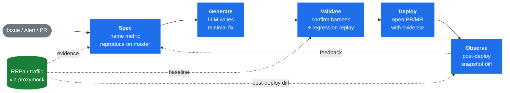

# Agent Factory

Agent Factory runs a complete software-delivery loop — **Spec → Generate → Validate → Deploy → Observe** — driven by an LLM grounded in real captured traffic. Every fix is validated against production RRPairs via `proxymock` before a human approves it.

## The loop



1. **Spec** — ingests an issue, alert, or PR; pulls a snapshot of captured traffic; identifies the measurable metric the bug violates; confirms the bug is reproducible.
2. **Generate** — LLM reads the relevant source files and writes a minimal fix.
3. **Validate** — runs the same reproduce harness against the patched code to confirm the metric is within bound; runs regression replay via proxymock.
4. **Deploy** — opens a PR/MR with the fix, harness output, and quality report as evidence.
5. **Observe** — post-deploy snapshot comparison closes the loop.

## How traffic gets in (BYOC)

In BYOC the customer's existing observability is the traffic source. The Grafana + Loki reference architecture is the canonical path:

```mermaid
flowchart LR
    apps([Customer apps]):::ext --> fwd[Speedscale<br/>Forwarder<br/>DLP + filter]:::sp
    fwd -->|OTLP gRPC| col[OTel<br/>Collector]:::sp
    col --> loki[(Loki)]:::store
    loki --> graf[Grafana<br/>dashboards]:::store
    loki -. loki-gather.py .-> snap[(Snapshot dir<br/>proxymock-readable)]:::sp
    snap --> af{{Agent Factory<br/>Spec phase}}:::af

    classDef ext fill:#6e7681,stroke:#6e7681,color:#fff
    classDef sp fill:#1f6feb,stroke:#1f6feb,color:#fff
    classDef store fill:#8957e5,stroke:#8957e5,color:#fff
    classDef af fill:#1a7f37,stroke:#1a7f37,color:#fff
```

Customer data never leaves the customer VPC. See the [Grafana reference architecture](https://github.com/speedscale/demo/tree/main/reference-architectures/grafana) for install steps.

## Deployment modes

The same binary runs three ways. See [`examples/instances/`](examples/instances/) for sample Helm values and [`speedstack/instances/agent-factory/`](https://gitlab.com/speedscale/skunkworks/speedstack/-/tree/main/instances/agent-factory) for the live deployments.

| Mode | Topology | When to use |
|---|---|---|
| **CLI** (`npm run llm-run`) | Single process on a laptop | One-off dispatches, local development, ticket-by-ticket runs |
| **Kubernetes** (Helm chart) | `intake-api` + `controller` + `worker` pods, filesystem or Redis queue | Continuous polling against a ticket source (GitHub, Linear), shared environment |
| **BYOC** (customer cluster) | Helm chart + customer's traffic store + customer's LLM endpoint | Production deployments where data must stay in the customer VPC |

In BYOC, the **traffic context** comes from the customer's existing observability — see the [Grafana + Loki reference architecture](https://github.com/speedscale/demo/tree/main/reference-architectures/grafana) in the demos repo, with the companion `loki-gather.py` script that turns a Loki slice into a `proxymock`-replayable directory.

### Configuration boundary

| | Speedscale Cloud (SOS) | Customer BYOC |
|---|---|---|
| Traffic data | Speedscale-hosted | Customer's proxymock + reference architecture |
| LLM endpoint | Anthropic (Speedscale key) | Customer's choice (Anthropic, Bedrock, Azure, self-hosted) |
| Code access | Speedscale's repos | Customer's git mirror |
| Deployment | Speedscale-operated | Helm chart in customer's cluster |
| Data boundary | Speedscale VPC | Customer VPC — data never leaves |

## Quick start — CLI

```bash
npm install
export ANTHROPIC_API_KEY=<your-key>

npm run llm-run -- \
  --title "Service X returning 429 errors on /api/sync" \
  --body  "Errors cluster in short bursts suggesting a concurrency problem." \
  --snapshot /path/to/snapshot/inner-dir \
  --source  /path/to/service/src \
  --workdir /tmp/llm-run-work \
  --verbose
```

Artifacts land in `--workdir`: `plan.json` (Planner output), `reproduce.mjs`, `confirm.mjs`, `patch.json`.

Check gate verdict for a specific run:

```bash
npm run gate:check -- --run <run-name>
```

## Quick start — Kubernetes

Install the chart against a cluster running `speedscale-operator`:

```bash
helm install agent-factory ./charts/agent-factory \
  --namespace agent-factory --create-namespace \
  --set engine.kind=claude-sdk \
  --set engine.authSecret.name=anthropic-api-key
```

See [`examples/instances/`](examples/instances/) for `internal/`, `customer/`, `demo/`, and `local/` value sets, and [`docs/users.md`](docs/users.md) for operator workflow.

## Core artifacts per run

| Artifact | Description |
|---|---|
| `plan.json` | Planner output: metric, baseline, hypothesis, target file |
| `reproduce.mjs` | Self-contained harness measuring the bug metric on unpatched code |
| `confirm.mjs` | Same harness run against patched code — the primary fix gate |
| `patch.json` | Worker output: fix, rationale, confirm result |
| `quality-report.json/.md` | Regression replay diff against baseline RRPairs |
| `result.json` | Run summary with phase outcomes |

## Documentation

**Design**
- [`docs/architecture.md`](docs/architecture.md) — system planes, deployment models, contracts
- [`docs/engine.md`](docs/engine.md) — LLM engine: tool catalog, agent loop, Planner/Worker
- [`docs/engine-source-mode.md`](docs/engine-source-mode.md) — non-traffic-shaped fixes path
- [`docs/engine-hardening.md`](docs/engine-hardening.md) — tool-call hardening: rescue, escalating nudges, prereqs, compaction
- [`docs/multi-deliverable-tickets.md`](docs/multi-deliverable-tickets.md) — handling checklist-style specs

**Operations**
- [`docs/users.md`](docs/users.md) — operators: deployment, run submission
- [`docs/operations.md`](docs/operations.md) — runbook
- [`docs/CONFIG.md`](docs/CONFIG.md) — every env var the binary accepts
- [`docs/release.md`](docs/release.md) — version bump + publish flow

**Agents**
- [`docs/agents/triage.md`](docs/agents/triage.md) — triage agent specifics

**Quality**
- [`docs/EVALS.md`](docs/EVALS.md) — eval substrate: fixtures, runner, dual-judge

> Recorded eval runs and other local training feedback live in each instance's
> directory under speedstack (e.g. `speedstack/instances/agent-factory/<instance>/training-feedback/`),
> not in this repo.

**Contributing**
- [`docs/developers.md`](docs/developers.md) — development workflow, contracts, release
- [`docs/plan.md`](docs/plan.md) — active roadmap
- [`docs/history.md`](docs/history.md) — pivot history and design decisions
