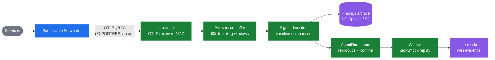

# Agent Factory

Agent Factory is a streaming traffic analysis engine that detects bugs in production, confirms they're real, and replicates them — grounded in actual request/response data from the Speedscale forwarder.

## How it works



The forwarder already captures all traffic (RRPairs) from instrumented services and streams it as OTLP log records. Agent Factory registers as another OTLP destination via the forwarder's `EXPORTERS` env var — no snapshot creation, no cloud round-trip, no batch processing.

### What works today

1. **OTLP gRPC receiver** — intake-api accepts `LogsService/Export` RPCs from the forwarder on port 4317
2. **Per-service buffering** — records grouped by service name in 60-second tumbling windows
3. **Signal detection** — on window close, finds error rate spikes, latency anomalies, N+1 query patterns, slow endpoints
4. **Baseline comparison** — signals compared against rolling per-endpoint baselines (2x p95 threshold)
5. **Correlation** — related signals (slow endpoint + slow downstream query) merged into incident groups
6. **Findings archive** — JSON findings with evidence uploaded to S3-compatible storage
7. **Prometheus metrics** — records received, windows processed, signals found, buffer depth per service
8. **Baseline accumulation** — every window's per-endpoint stats feed a rolling baseline so regressions are detected relative to normal, not just static thresholds
9. **Evidence archival** — the failing RRPairs for each signal are tarred to S3, keyed by fingerprint, so the bug stays replayable
10. **Detect → confirm → replicate loop** — high-severity regressions enqueue a `reproduce` AgentRun; the worker replays the archived traffic, confirms the signal reappears, and files a Linear ticket with the evidence

### The killer feature

The closed loop — **detect, confirm, replicate** — is wired end-to-end. No other tool can do this because nobody else has the full request/response payloads AND an AI agent that can act on them. Production rollout needs live config (`REPRODUCE_REPLAY_TARGET`, `LINEAR_API_KEY`, `LINEAR_REPRODUCE_TEAM_ID`) and threshold tuning.

See [`docs/plan.md`](docs/plan.md) for the roadmap and remaining P1/P2 work.

## Architecture

Three processes, one image:

| Process | Role |
|---|---|
| `intake-api` | HTTP API (:8080) + OTLP gRPC receiver (:4317) + run queue + metrics |
| `worker` | Polls queue, executes agent runs (triage, bug-fix, reproduce) |

See [`docs/architecture.md`](docs/architecture.md) for full system design.

## Deployment

Helm chart alongside `speedscale-operator`:

```bash
helm install agent-factory ./charts/agent-factory \
  --namespace agent-factory --create-namespace \
  --set engine.kind=claude-sdk \
  --set engine.authSecret.name=anthropic-api-key \
  --set intakeApi.otlp.enabled=true \
  --set intakeApi.otlp.archiveSecret.name=agent-factory-archive-s3
```

Then add Agent Factory as a forwarder OTLP destination in the operator ConfigMap or forwarder ConfigMap:

```json
{
  "agent_factory": {
    "otel_endpoint": "http://agent-factory-intake-api.agent-factory.svc.cluster.local:4317",
    "dlp_config_id": "standard",
    "filter_rule": "standard"
  }
}
```

## CLI mode

For one-off runs against existing traffic:

```bash
npm install
export ANTHROPIC_API_KEY=<your-key>

npm run llm-run -- \
  --title "Service X returning 429 errors on /api/sync" \
  --body  "Errors cluster in short bursts suggesting a concurrency problem." \
  --snapshot /path/to/snapshot/inner-dir \
  --source  /path/to/service/src \
  --workdir /tmp/llm-run-work \
  --verbose
```

## Documentation

| Doc | Audience |
|---|---|
| [`docs/architecture.md`](docs/architecture.md) | System design, streaming pipeline, deployment |
| [`docs/plan.md`](docs/plan.md) | Roadmap: close the detect/confirm/replicate loop |
| [`docs/CONFIG.md`](docs/CONFIG.md) | Every env var the binary accepts |
| [`docs/operations.md`](docs/operations.md) | Metrics, thresholds, runbook |
| [`docs/engine.md`](docs/engine.md) | LLM engine: tool catalog, agent loop |
| [`docs/developers.md`](docs/developers.md) | Development workflow |
| [`docs/history.md`](docs/history.md) | Refactor history and design decisions |
| [`docs/release.md`](docs/release.md) | Version bump + publish flow |
| [`docs/EVALS.md`](docs/EVALS.md) | Eval substrate |
