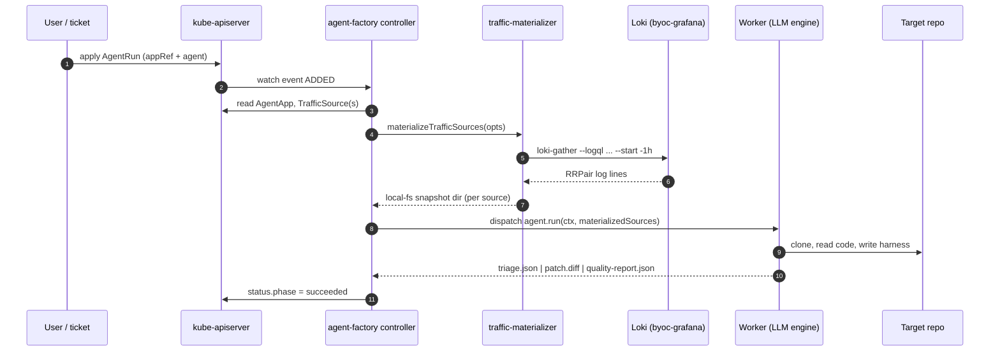

# Architecture

Audience: Agent Factory developers and contributors.

## The loop

Five phases. Each has a clear input, output, and tool surface. The loop closes from Observe back to Spec.

```
Spec → Generate → Validate → Deploy → Observe
 ↑                                        │
 └────────────── feedback ───────────────┘
```

### Spec (+ Reproduce)

Input: issue, alert, or PR trigger.

The Planner inventories RRPair coverage for the affected service via `search_traffic`, then:

1. Names the **measurement metric** — the specific, quantifiable property the bug violates. Examples: *peak concurrent calls to X > 10*, *error rate on /api/sync > 5%*, *P95 latency > 500ms*.
2. Confirms the metric is measurable from the available snapshot evidence.
3. Writes and runs a **reproduce harness** against unpatched code. Records the baseline measurement.

If the metric cannot be reproduced from the snapshot, the Planner files a coverage-gap triage and halts. It does not proceed to Generate.

Output: evidence inventory, metric definition, baseline measurement, reproduce harness.

### Generate

Input: Planner output (metric, hypothesis, target file, baseline harness).

The Worker reads the relevant source files, writes the minimal fix, and saves it to the target file.

Output: patched source file, rationale.

### Validate

Two jobs:

1. **Confirm metric** — run the same reproduce harness against the patched code. The metric must now be within the acceptable bound. This is the primary gate. Reproduce and confirm use identical methodology (same harness, same mock, same threshold).
2. **Regression replay** — start mock for downstream deps, replay inbound RRPairs via proxymock, diff with `compare_rrpair_files`. Unexpected status or payload divergence fails the gate.

Output: `QualityReport` with before/after metric, regression diff, confirm harness output.

### Deploy

Deployer opens a PR/MR. PR body contains: spec, rationale, QualityReport, reproduce + confirm harness outputs, link to run artifacts.

### Observe

24–72h post-deploy: pull a new production snapshot and confirm the bug metric dropped to acceptable levels. This closes the loop. The post-deploy snapshot becomes the new evidence baseline.

---

## BYOC end-to-end on Grafana

The loop above is engine-agnostic about where traffic comes from. The
**BYOC Grafana** path wires Loki as the evidence store: every RRPair the
Speedscale operator captures is shipped as a structured log line, and the
controller pulls a fresh slice into a local snapshot directory at AgentRun
start. Nothing downstream of the snapshot changes — the Worker reads it
through the same `local-fs` interface used by the speedscale-cloud path.



The same shape applies to Elasticsearch (`store.kind: elasticsearch` →
`es-gather`) and Speedscale Cloud (`store.kind: speedscale-cloud` → `proxymock
cloud pull`). The materializer hides the difference behind a single
`local-fs` rewrite — see `src/lib/traffic-materializer.ts`.

---

## System planes

### Engine plane

The LLM orchestrator. Runs as Planner (Spec phase) then Worker (Generate + Validate phases).

```typescript
interface Engine {
  plan(spec: SpecInput, tools: ToolCatalog): Promise<AgentPlan>
  generate(plan: AgentPlan, tools: ToolCatalog): Promise<CandidatePatch>
  summarize(run: AgentRun): Promise<QualityReport>
}
```

Three backend options behind one interface:

| Option | Backend | When to use |
|---|---|---|
| 1 | Claude Agent SDK (Anthropic / Bedrock) | Default; best quality |
| 2 | Generic LLM SDK (OpenAI-compatible) | Azure or vendor-agnostic |
| 3 | Self-hosted vLLM / TGI | Air-gapped, regulated |

Implementation: `src/lib/llm-engine.ts`. See `docs/engine.md` for tool catalog and agent loop detail.

### Tool plane

The LLM's only interface to the outside world. All tool calls are deterministic and logged.

**Engine-native tools** (implemented in `llm-engine.ts`):

| Tool | Role |
|---|---|
| `read_file` | Read source files |
| `search_code` | Grep across JS/TS source |
| `list_snapshot_dir` | List RRPair files by host |
| `read_rrpair` | Read a single RRPair markdown file |
| `write_file` | Write generated harnesses or patches |
| `run_script` | Execute a Node.js script and return output |
| `emit_plan` | Terminal: Planner outputs structured AgentPlan |
| `emit_patch` | Terminal: Worker outputs fix + confirm result |

**proxymock MCP tools** (shipped in proxymock binary, called via MCP):

| Tool | Role |
|---|---|
| `search_traffic` | Evidence search by service, time, status, URL |
| `pull_remote_recording` | Snapshot filtered traffic as RRPairs |
| `mock_server_start/stop` | Stand in for downstream deps |
| `replay_traffic` | Replay RRPairs against the patched service |
| `compare_rrpair_files` | Structured regression diff |
| `record_traffic_start/stop` | Capture fresh traffic when coverage is short |

Planned MCP additions (not yet shipped): `summarize_traffic`, `validate_candidate`, `extract_for_prompt`, load mode on `replay_traffic`. See `docs/plan.md`.

### Control plane

App-agnostic orchestration. Reads `AgentApp` manifests; contains no repo-specific logic.

- **Intake API** — normalizes triggers (issue, PR, alert, Slack, direct API) into `AgentRun` CRD
- **Run queue** — filesystem or Redis backend; workers poll and claim runs
- **Run store** — S3-compatible object store or PVC; holds artifact tree per run
- **Review UI** — React SPA showing run status, QualityReport, reproduce/confirm output; human approves PR from here
- **RBAC** — OIDC; two roles: `viewer`, `approver`
- **Audit log** — append-only; every state transition and tool call is logged

### Context plane

Customer-owned data. Never leaves the VPC. Reaches the LLM only via tool-plane calls, after DLP masking.

- Speedscale RRPair store (captured traffic)
- Metrics (Speedscale + Prometheus)
- Logs (Loki, Elasticsearch, Splunk)
- Source code + SCM (git mirror, PR target)

---

## Deployment models

### Speedscale Cloud

Speedscale operates the agent factory against its own services (SOS — Speedscale on Speedscale).

- Agent factory runs in Speedscale's k8s cluster
- LLM: Anthropic direct (Speedscale's API key)
- Traffic: Speedscale's own proxymock captures
- Code: Speedscale's GitLab repos
- PRs: Speedscale's GitLab

This is the validation environment. Features proven here ship to BYOC.

### Customer BYOC

Customer installs via Helm alongside `speedscale-operator`. Everything stays in the customer's VPC.

```bash
helm install agent-factory speedscale/agent-factory \
  --set engine.kind=claude-sdk \
  --set engine.auth.secretRef=anthropic-api-key \
  --set scm.provider=github \
  --set scm.auth.secretRef=github-pat
```

```yaml
engine:
  kind: claude-sdk          # claude-sdk | generic-llm | private-llm
  model: claude-sonnet-4-7
  endpoint: https://api.anthropic.com
  auth: secretRef/anthropic-api-key
```

Air-gapped customers use `kind: private-llm` with an in-cluster vLLM deployment. The system behaves identically; quality may differ until open-weights models improve on coding tasks.

---

## Contracts

### `AgentApp`

Declares everything the agent needs to work on a service:

- repo provider, URL, default branch, workdir
- build/install/start commands
- validation commands and proxymock dataset
- quality policy (fail on regression, auto-branch, auto-MR)
- engine configuration (kind, model, endpoint)

### `AgentRun`

Captures the lifecycle of one fix attempt:

- trigger source (issue/PR/alert/manual)
- issue spec (title, body, URL)
- workspace root and branch
- phase: `queued → planned → building → validating → succeeded/failed`
- artifact pointers

### `AgentPlan`

Output of the Planner phase:

- summary and hypothesis
- metric and baseline measurement
- steps (reproduce → fix → confirm → report)
- target file and function

### `QualityReport`

Output of the Validate phase:

- before/after metric values
- regression replay pass/fail
- structured diff
- confirm harness output

---

## Artifact tree per run

```
artifacts/<run-name>/
  run.json              ← AgentRun lifecycle state
  plan.json             ← AgentPlan (Planner output)
  reproduce.mjs         ← baseline measurement harness
  confirm.mjs           ← same harness against patched code
  patch.json            ← Worker output (fix, rationale)
  build.log
  validation.log
  quality-report.json
  quality-report.md
  result.json
```

---

## Reliability guardrails

- **Reproduce is a hard gate.** Planner halts and files a triage comment if metric is not measurable from available evidence.
- **Deterministic workers** — one run at a time per worker process; per-run claim file prevents double execution.
- **Isolated workspace** — Worker operates in `.work/<run-name>/`; never writes to live source except via `write_file` tool (which is logged).
- **Evidence-first completion** — run is not marked `succeeded` without proxymock replay exit `0` and confirm harness exit `0`.
- **Agent-generated harnesses are tagged** — labeled in QualityReport; require human approval before joining the regression baseline.
- **Humans gate merges** — auto-merge is opt-in per `AgentApp`, behind a quality threshold.

---

## Known limitations (current)

- Run store is file-based; assumes shared filesystem. Object-store backend is planned.
- proxymock MCP `summarize_traffic` not yet implemented — Planner reads raw RRPair files.
- Worker writes fixes directly to source; isolated-branch mode (git clone + branch per run) is next.
- No load-test phase yet (`replay_traffic` load mode not implemented).
